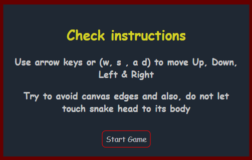
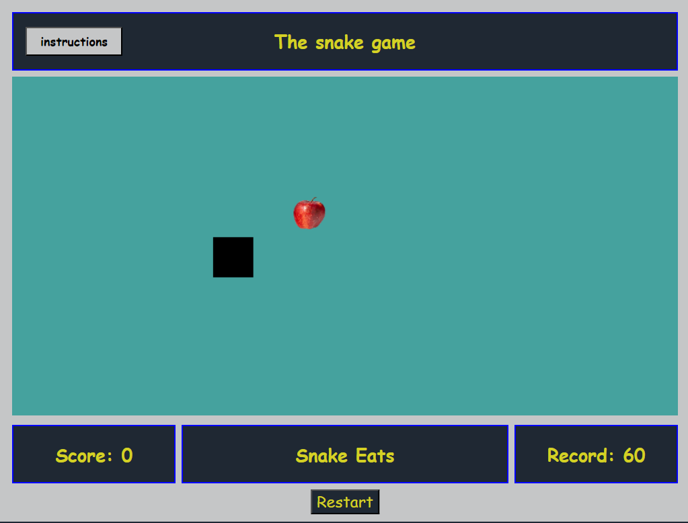

# Snake game

**SEBPT220 Project 1: The Snake Game**

To play the Snake Game, please visit: https://github.com/DPreet12/Dpreet12.game.io

## HOW TO PLAY

Move the snake across the board to collect food and to increment your score. If possible, try to beat the previously achieved record score. Be careful from obestacles such as canvas walls and snake's body. Snake will grow every time after eating the food and every food bite from snake will adds 5 points to the score board.

Use `arrow keys` or for the movement of the snake. Also, same functionality for snake movements can achieved by using keyboard buttons such as `"w"` to move up, `"s"` to move down, `"a"` to move left and `"d"` to move right the main canvas.

Use `instructions button` from top left corner of the canvas to read instructions. Instructions will appear in middle of the canvas. Press `Start Game` button from the instructions menu to play the game.

Also, if snake is alive, bottom middle container of the canvas will show text "snake lives" otherwise it will show "Snake is dead" and alert message on top of the page will show "Game over" message. To restart the game, use `restart` button from the bottom-middle of the canvas.

## Instructions Screen



## Main Screen



## HOW TO INSTALL

1. `Fork` and `clone` this respositiry in your machine.
2. Open file `index.html` on your to play
3. Open directory in vscode or any editor to view or to make edits in the code


## Note:  The images and thier editing was done by using free resources 

1. https://unsplash.com/
2. https://www.remove.bg/


## HOW IT WORKS

The main characters of the snake and food image were created by using the classes called chracter and imageClass. Snake was drwan in the main canvas by fillRect and drawImage was used to draw the image.

```js
class Chracter {
    constructor (x, y, color, width, height, xVel, yVel) {
        this.x = x;
        this.y = y;
        this.color = color;
        this.width = width;
        this.height = height;
        this.alive = true;
        this.xVel = xVel;
        this.yVel = yVel;

        this.render = function() {
            ctx.fillStyle = this.color;
            ctx.fillRect(this.x, this.y, this.width, this.height); // to draw the snake
        }

        this.updatePosition = function() {
            this.x += this.xVel ;
            this.y += this.yVel ; // for the towards x and y co-ardinates
            
        }
    }
}

class ImageClass {
  constructor(x, y, image, width, height) {
      this.x = x;
      this.y = y;
      this.image = image;
      this.width = width;
      this.height =height;
      this.alive = true;

      this.render = function() {
            ctx.drawImage(this.image, this.x, this.y, this.width, this.height);
      }
 }
}
```
The main logic of the game runs in a gameLoop when snake eats the food the snake grows by updating the position of its segments and by using for loop which runs bacwards and snake's head stays still after the loop,  head position gets updated. 1d array was used to store all the segments of the snake.

Sniipet from `gameLoop`:

```js
 for( let i = (snakeArr.length - 1); i > 0; i--){ 
        snakeArr[i].x = snakeArr[i -1].x;
        snakeArr[i].y = snakeArr[i - 1].y
        
    }
    snakeArr[0].x += snake.xVel * snake.width
    snakeArr[0].y += snake.yVel * snake.width
```

walls function were used to check the obestacles such as canvas walls and snake's head colliding with its body. Basically, the first element of the snake's arrray(head of the snake) was taken and its x and y co-ordinates were compared with all other elemets, if any match were found, gameOver status  changed to be true and alert message was displayed. Similarly, x and y co-ordinates of the snakehead were compared with walls of the canvas with respect to height and width

Snippet from `walls`: 
```js
for( let i = 2; i < snakeArr.length; i++) {
    if( snakeArr[0].x === snakeArr[i].x && snakeArr[0].y === snakeArr[i].y) {
        return true;
    }
  }
  if( snakeArr[0].x <= 0 || snakeArr[0].x + snakeArr[0].width > gameNew.width || snakeArr[0].y <= 0 || snakeArr[0].y + snakeArr[0].height > gameNew.height) {
    return true;
  }
  ```


To check the collision between snake and food, and to update the position of the food every time when snake collided with it we used the findFood function and with each collision 5 points were incremented

Snippet from `findFood`:
```js
    if ( snake.y + snake.height > newImage.y &&
    snake.y < newImage.y + newImage.height &&
     snake.x + snake.width > newImage.x &&
    snake.x < newImage.x + newImage.width) {
       newScore += 5;
       yourScore.textContent = `Score: ${newScore}`

      newImage.x = Math.floor(Math.random() * (gameNew.width - 70));
       newImage.y = Math.floor(Math.random() * (gameNew.height - 120));
    }
```

In order to draw instructions, create Element methods were used to create div, h2, p and buttton elements and h2, p and button were appended to div with id of instructions. if start button is clicked from instructions menu, gameInit function will be intilized which will remove the instructions box from screen and run the game. Also, restart button was used to restart the game if snake ends up dead.

To intialize the game after the instructions are drawn:
```js
function gameInit() {
  
  
 
    document.querySelector("#instructions").remove();
   
   
   startBtn.removeEventListener("click", gameInit)
   
    gameLoop();
}
```

To restart the game if snake is dead: 

```js
function restart() {
  if( gameOver) {
    
    snake.x = 250;
    snake.y = 200;
    newImage.x = 350;
    newImage.y = 150;
    snakeArr = [snake];
    gameOver = false;
    movement.textContent = "Snake lives"
    movement.style.color ="#C5C6C7";
   
  }
  gameLoop()
}
```

The game is  mainly controlled by DOM manipulation and event listeners, by using click and keydown actions.

## FUTURE CONSIDERATIONS

My main focus was to ensure the working functionality for this game. However, my intial idea was to use rectangles of diffrent shapes for snake and food. But I ended up adding image class in my code to show the apple image for the food. Due to the presentation due date and to fix the bugs, I had to put stop but there still few things can be done.
For example, Increasing the difficuly level by adding more obestacles and multiple images for the food can be shown.

## Wireframe


